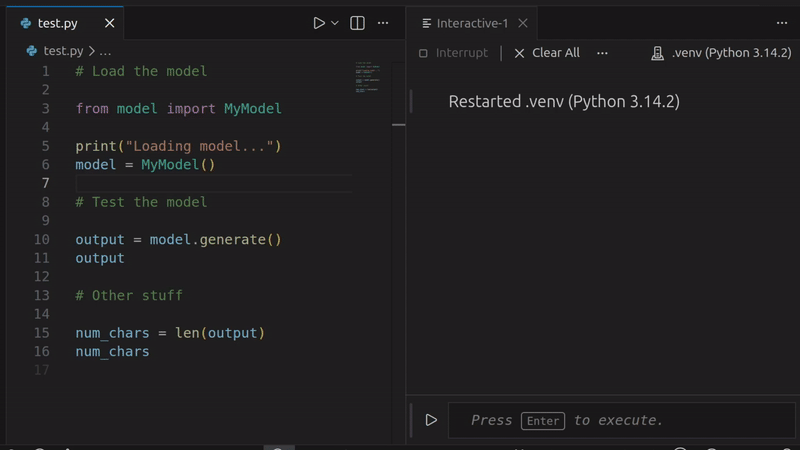

# Run from Previous Comment

A minimal VS Code extension designed to streamline working in the **Python Interactive Window**.

This is a simple helper tool to execute code blocks without manually highlighting them. It is designed for workflows that rely on comments to delineate sections of code.

[View in Marketplace](https://marketplace.visualstudio.com/items?itemName=nicolvisser.run-from-comment) or search for `run-from-comment`.

## Functionality

The extension finds the first Python comment (`#`) above your current cursor position and executes everything from that comment line down to your cursor in the Jupyter Interactive Window.

- **No manual highlighting:** It programmatically selects the block for you.
- **Indentation aware:** Handles comments indented inside functions, loops, or classes.
- **Visual Feedback:** Briefly flashes the background of the executed block and updates the status bar with the name of the section.

## Usage

1. Place your cursor anywhere in a Python file.
2. Trigger the command.
3. The code from the nearest preceding `#` to your cursor will be sent to the Interactive Window.

### Keybindings
The default shortcut is a chord:
- **Windows/Linux:** `Ctrl+K`, then `G`
- **macOS:** `Cmd+K`, then `G`

### Context Menu
Right-click on a line in the editor and select **"Jupyter: Run from Previous Comment"**.

## Requirements

This extension requires the official [Jupyter extension](https://marketplace.visualstudio.com/items?itemName=ms-toolsai.jupyter) by Microsoft to be installed and active.

## Installation

Install manually from the `.vsix` file in [releases](https://github.com/nicolvisser/run-from-comment/releases):
1. Open the **Extensions** view in VS Code.
2. Click the `...` menu in the top right.
3. Select **Install from VSIX...** and choose your generated file.